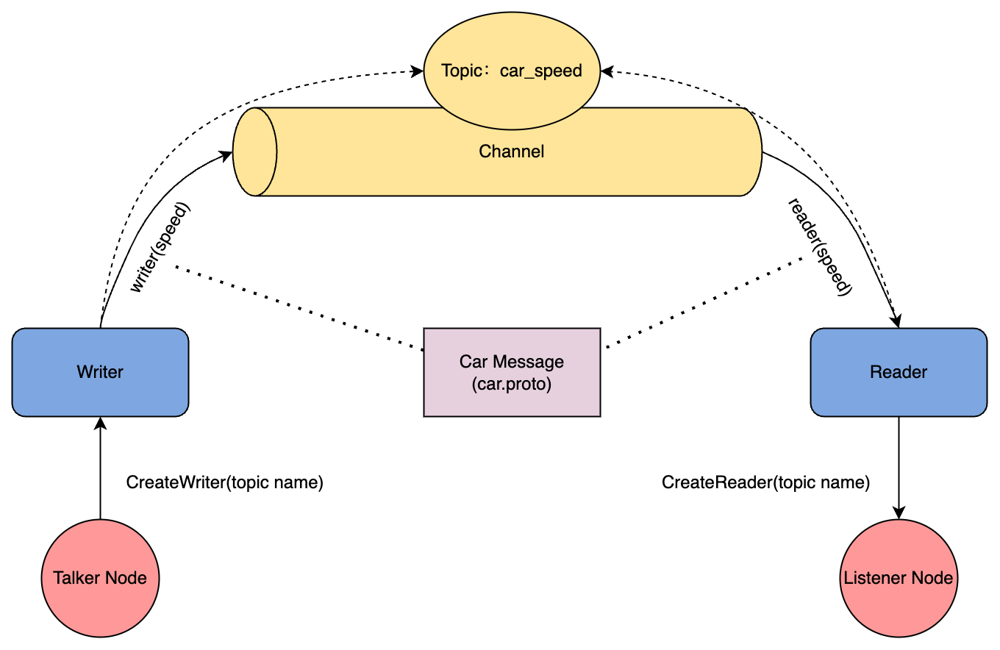
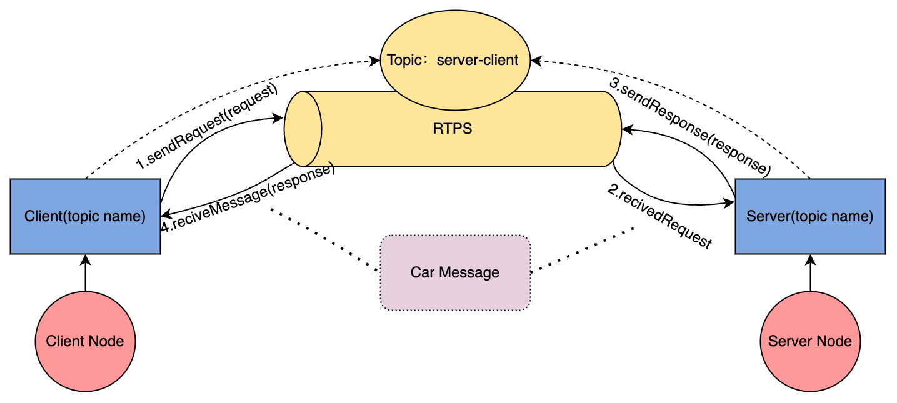
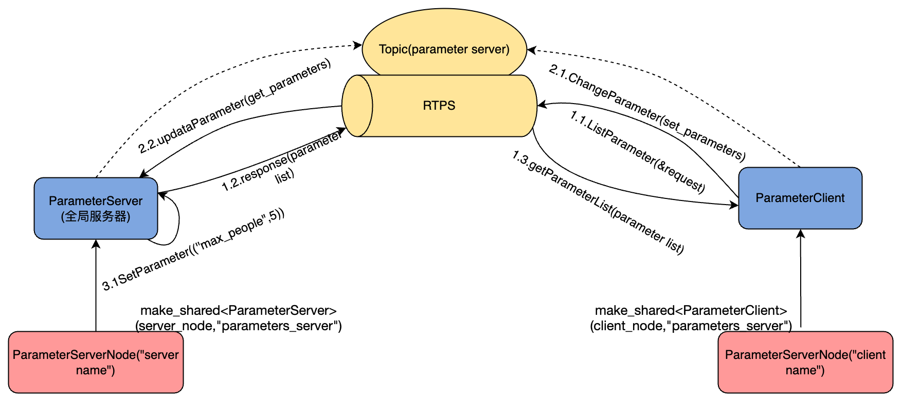

# CyberRT notes
[TOC]

## protobuf
Protobuf 是 Google 公司开发的一种跨语言和平台的序列化数据结构的方式，是一个灵活的、高效的用于序列化数据的协议，与 XML 和 JSON 格式相比，Protobuf 更小、更快、更便捷。
Protobuf 是跨语言的，并且自带一个编译器( protoc )，只需要用protoc进行编译，就可以编译成 Java、Python、C++、C#、Go 等多种语言代码，然后可以直接使用，不需要再写其它代码，自带有解析的代码。只需要将要被序列化的结构化数据定义一次(在 .proto 文件定义)，便可以使用特别生成的源代码(使用protobuf提供的生成工具)轻松的使用不同的数据流完成对结构数据的读写操作。甚至可以更新 .proto 文件中对数据结构的定义而不会破坏依赖旧格式编译出来的程序。其优点如下：
* 性能效率高：序列化后字节占用空间比 XML 少3-10倍，序列化的时间效率比 XML 快20-100倍。
* 使用便捷便捷：将对结构化数据的操作封装成一个类，便于使用。
* 兼容性高：通信两方使用同一数据协议，当有一方修改了数据结构，不会影响另一方的使用。
* 跨语言：支持 Java，C++，Python、Go、Ruby 等多种语言。


## 话题通信

- **模式**：
    以发布订阅的方式实现不同节点之间数据交互的通信模式。
    如图1-1所示，Listener-Talker通信首先创建了两个Node，分别是Talker Node和 Listener Node。
    每个Node实例化Writer类和Reader类对Channel进行消息的读写。
    Writer和Reader通过Topic连接，对同一块共享内存（Channel）进行读写处理。
    Talker Node 为了实现其“诉说”的功能，实例化Writer，通过Writer来对Channel进行消息写操作。
    Listener Node为了实现其“聆听”功能，实例化reader类，通过Reader来对channel进行读操作。
- **场景**：
    话题通信方式适合于持续性通信的应用场景，比如雷达信号，摄像头图像信息这类数据的传输。
- **使用**：
    Listener-Talker通信一方主动送消息，一方被动接收。
    我们想要一直获取车的速度，该需求不需要向发送方返回什么消息，也不需要发送方对消息进行进一步处理。所以我们选择了Listener-Talker通信方式实现该功能。
- **数据定义**：
    话题通信中用的的数据格式的定义car message 定义在car.proto中。
## 服务通信

- **模式**：
    以请求响应的方式实现不同节点之间数据交互的通信模式。
    如图所示，Server-Client通信可以在客户端发出消息请求时，服务端才进⾏请求回应，并将客户端所需的数据返回给客户端。
- **场景**：
    我们想要获得⼩⻋的详细信息，⽐如⻋牌这些，但是⼜不需要⼀直获得该信息，想要在需要知道这些信息的时候请求⼀下就好，于是考虑⽤Server- Client通信实现该功能。
- **使用**：
    该通信模式适合临时的消息传输，适⽤于不需要持续性发送数据的场景。
- **数据定义**：
    服务通信中用的的数据格式的定义在car.proto中。
## 参数通信

- **模式：**
    以共享的方式实现不同节点之间数据交互的通信模式。
    参数服务器是基于服务实现的，包含客户端和服务器端，服务端节点可以存储数据，客户端节点可以访问服务端节点操作数据，这个过程虽然基于请求响应的，但是无需自己实现请求与响应，此过程已经被封装，调用者只需要通过比较简单友好的API就可以实现参数操作。
- **场景**：
    自动驾驶场景中有一些参数比如该车的最高限速、最多乘客以及是否自动驾驶等需要被各个模块使用数据，比如是否自动驾驶这个参数可能同时影响这很多模块，也可能被很多模块运行时所更改。
    这些数据如何实现在不同模块之间的共享呢?
- **使用**：
    类似于“全局变量”的方式来存储这些参数，并定义一些自定义参数来进行使用。
- **数据定义**：
    Cyber中设计了全局参数服务器来实现这个功能，其通信基于RTPS协议。该通信方式服务端和客户端都可以设置参数和更改参数。
## bazel 编译

## 组件
Apollo 的 Cyber RT 框架是基于组件概念来构建的。每个组件都是 Cyber RT 框架的一个特定的算法模块， 处理一组输入并产生其输出数椐。
要创建并启动一个算法组件，需要通过以下 4 个步骤：

- 初如化组件的目录结构
- 实现组件类
- 设置配置文件
- 启动组件

至少需要以下文件：
- C++头文件: common_component_example.h
- C++源文件: common_component_example.cc
- Bazel 构建文件: BUILD
- DAG 文件: common.dag
- Launch 文件: common.launch
### 源文件和头文件
源文件要干的事是至少是实现Init和Proc函数。
头文件 common_component_example.h 中定义了组件的接口，主要要干的事情就是
- 继承 Component 类
- 定义自己的 `Init` 和 `Proc` 函数。Proc 需要指定输入数椐类型。
- 使用`CYBER_REGISTER_COMPONENT`宏定义把组件类注册成全局可用。
### 构建文件
BUILD中要干的是定义 libxxx_component.so
    声明 deps:
        //cyber
        //xxx/proto:xxx_cc_proto
一般来说会有cc_binary和cc_library,
```
【编译阶段】
bazel build //path/to/pkg:libxxx_component.so
        ↓
编译 proto
        ↓
编译 component.cc
        ↓
链接 cyber / protobuf / 其它依赖
        ↓
生成:
bazel-bin/path/to/pkg/libxxx_component.so
```
### DAG 文件
common.dag 中定义了组件的依赖关系，主要要干的事情就是
- 定义组件的依赖关系
- 定义组件的启动顺序
- 定义组件的停止顺序
配置如下
- Channel names: 输入 Channel 的名称
- Library path: 该组件生成的共享库路径
- Class name: 此组件类的名称

**readers 的数量和顺序决定输入 channel 的数量和参数绑定顺序。**
### launch文件
common.launch
    指定:
        dag_conf: "xxx.dag"
        process_name: "xxx_process"
也就是
- 组件的名字
- 上一步配置的 DAG 文件路径
- 运行组件时的进程名

启动方式主要有两种方式
```bash
# 第一种
mainboard -d cyber/examples/common_component_example/common.dag
# 第二种
cyber_launch start xxx.launch
```
## 运行阶段过程
cyber_launch 启动 mainboard。
mainboard 读取 DAG，加载 .so，创建 Component，调用 Init。
消息到达后，Scheduler 唤醒任务，Processor 执行 Proc。
```
cyber_launch start xxx.launch
        ↓
启动 mainboard 进程
        ↓
mainboard 读取 xxx.dag
        ↓
加载 libxxx_component.so
        ↓
根据 class_name 找到 XxxComponent
        ↓
创建 Component 实例
        ↓
调用 Init()
        ↓
根据 readers 创建输入通道缓存/访问器
        ↓
注册调度任务 CRoutine
        ↓
等待主 channel 消息
```
**多输入 Component 以第一个 reader 为主 channel。
主 channel 到消息时，尝试取其它 channel 的 latest 数据。
全部输入都有数据，才进入 Proc。**
## 消息触发阶段
```
主 channel 收到新消息
        ↓
放入 ChannelBuffer
        ↓
DataNotifier 通知任务
        ↓
Scheduler 唤醒 CRoutine
        ↓
DataFusion 尝试融合:
        msg0 = 主 channel 新消息
        msg1 = 副 channel latest 消息
        ↓
如果所有输入都可用:
        调用 Proc(msg0, msg1)
        ↓
Proc 里处理业务
        ↓
可通过 Writer 发布输出 channel
```
**主 channel 决定处理频率；
副 channel 提供 latest 状态；
所有输入至少有过数据，Proc 才能跑。**

## 常用命令
进入容器
```bash
# 宿主机
bash docker/scripts/dev_into.sh
```
### 查询 Bazel target
```bash
# 查当前 cyber/examples 这个 BUILD 里的 target
bazel query //cyber/examples:all

# 查 cyber/examples 及子目录所有 target
bazel query //cyber/examples/...

# 显示 target 类型
bazel query //cyber/examples:all --output=label_kind

# 查某个目标的一层直接依赖
bazel query 'deps(//cyber/examples:listener, 1)'

# 查某个目标所有依赖，可能很多
bazel query 'deps(//cyber/examples:listener)'
```
### 编译和查产物
```bash
# 编译普通二进制
bazel build //cyber/examples:talker
bazel build //cyber/examples:listener

# 编译 Component 动态库
bazel build //cyber/examples/common_component_example:libcommon_component_example.so

# 查询输出文件
bazel cquery //cyber/examples:talker --output=files
bazel cquery //cyber/examples/common_component_example:libcommon_component_example.so --output=files

# 查看 bazel-bin 根目录
bazel info bazel-bin
# 一般来说运行文件会在/apollo/bazel-bin/...
```
### 运行命令
```bash
cd /apollo
source cyber/setup.bash
export GLOG_log_dir=/tmp/apollo_log

bazel build //cyber/examples/common_component_example:libcommon_component_example.so

cyber_launch start /apollo/cyber/examples/common_component_example/common.launch

# 或者
mainboard -d /apollo/cyber/examples/common_component_example/common.dag
```
