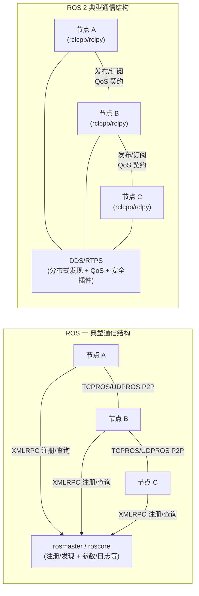

# ROS1 vs ROS2
[toc]
## 本质区别
>
- ROS 1 的核心计算图里有 Master、Parameter Server、Topics、Services 等；roscore 本身就包含了 Master + rosout + parameter server。Master 负责命名和注册，Parameter Server 运行在 ROS Master 里，并通过 XMLRPC 暴露接口。
- ROS 2 则把底层通信重构到了 DDS/RTPS 中间件 之上，采用分布式发现，不再依赖 ROS 1 那样的集中式 Master。
## 发现机制
- ROS 1 需要 roscore。Master 提供 naming / registration 服务，节点先去找 Master，再建立连接。这个模型好理解、好排查，但 Master 天生是架构中的中心点。
- ROS 2 默认不使用集中式发现，而是靠 DDS 做分布式发现。好处是更适合多机、复杂网络、去中心化部署；代价是发现过程更复杂，有时启动后不会像 ROS 1 那样“立刻全都可见”

工程含义：
1. 小型单机实验：ROS 1 更直观
2. 多机系统、分布式部署：ROS 2 结构更合理
3. 但 ROS 2 的发现、网络隔离、RMW 选择、QoS 不匹配，都会让排障复杂度上升
## 参数系统
- ROS 1 的 Parameter Server 运行在 Master 内。它更像一个全局共享配置仓。
- ROS 2 的参数是和节点绑定的，参数生命周期通常跟节点一致；节点一般要先声明自己接受哪些参数，这样类型和名称在启动时就更明确，能减少误配置。
工程含义：
1. ROS 1：全局改参数很方便，但也更容易“谁都能动”，大型系统里容易失控
2. ROS 2：参数边界更清晰，更适合组件化、产品化和可维护性要求高的项目
## 通信模型
ROS1 是经典的Topic、Service模型，ROS 2 官方把三类接口的用途讲得很明确：
- Topic：连续数据流，如传感器、状态流
- Service：快速 RPC，请求-响应，适合短操作
- Action：长时间任务，带反馈，可取消/抢占
## QoS
ROS 2 提供丰富的 QoS 策略，合适配置下，它可以像 TCP 一样可靠，也可以像 UDP 一样 best-effort；
并且不像 ROS 1 那样主要只有 TCP 路线。QoS 可单独配在 publisher、subscription、service server/client 上。
ROS 2 可以针对不同流量类型做精细化配置，比如：
- 激光雷达 / 图像：可能更偏 sensor-data / best effort
- 控制命令：可能更偏 reliable
- 低带宽无线网络：QoS 需要针对网络状况调参。
**ROS 1 的优点是“简单、默认能跑”；ROS 2 的优点是“可控、可调、适应复杂环境”。
但也正因为可调，ROS 2 的坑会更多：QoS 一旦两端不兼容，消息可能根本送不到。**
## 执行模型
- ROS 1 的 spin 更直接，ROS 2 的 Executor 更强
- ROS 2 官方明确说，执行管理由 Executors 负责，Executor 用一个或多个线程去调度 subscription、timer、service、action 等回调；相对 ROS 1 的 spin 机制，ROS 2 给了你更强的执行管理控制力。甚至还提供 WaitSet 用于更可控、偏确定性的调度。
工程含义：
1. ROS 1：上手快，思维负担小
2. ROS 2：可以做更细的线程、回调组、调度控制，更适合复杂系统、中间件层、需要考虑实时性和执行顺序的模块。
**这也是为什么很多系统软件/架构岗位会更重视 ROS 2 的 executor、callback group、waitset，而不只是“会发 topic”。**
## 单进程优化
ROS 1 nodelet vs ROS 2 component/composition
- ROS 1 为了减少进程间拷贝，引入了 nodelet，其目标就是让多个算法在同一进程内运行，并支持 zero-copy transport。
- ROS 2 把这个思路做成了更统一的 Component / Composition。官方文档明确写了：
  - ROS 1：nodes 和 nodelets 是两套风格
  - ROS 2：推荐用 component，统一 API，避免 ROS 1 那种“两套写法”的割裂
部署时可以自由选择“多进程隔离”或“单进程低开销”
工程含义：
1. ROS 1 的 nodelet 很有用，但工程体验并不总是优雅
2. ROS 2 的 composition/component 更适合做大系统的部署优化
对 **高带宽数据（图像、点云）** 来说，这个差别很关键。

## 生命周期管理
ROS 1 基本没有统一方案，ROS 2 有 LifecycleNode
- ROS 2 引入了 managed nodes / LifecycleNode，有一套明确的状态机：如 unconfigured、inactive、active、finalized 以及各种 transition states。
这件事在 demo 时可能感受不深，但在真正产品化系统里价值很大：
1. 设备驱动什么时候初始化
2. 感知模块什么时候进入 active
3. 故障恢复时是 deactivate 还是 cleanup
4. 上层编排如何感知模块状态
这些在 ROS 1 里通常要自己做约定，ROS 2 至少给了统一语义。

## 安全
ROS 1 基本弱，ROS 2 原生接入 DDS-Security
- ROS 2 官方明确说明：安全能力来自底层 DDS Security plugins，可提供加密、认证、访问控制；并且通过 enclave 概念，可以把策略映射到进程、设备或一组节点。
- ROS 1 则没有把安全作为核心架构的一部分来设计。
当系统涉及：
1. 多机联网
2. 无线链路
3. 产品部署
4. 权限隔离
5. 真实环境接入
ROS 2 的架构会更合理。

## 构建系统与工程组织
catkin vs ament + colcon
- ROS 1 的官方构建系统是 catkin。
- ROS 2 的包创建和构建则使用 ament 作为 build system、colcon 作为 build tool。官方还明确说 colcon 是对 catkin_make / catkin_tools / ament_tools 的进一步演进。

## 性能分析
别简单理解成“ROS 2 一定更快”
ROS 2 的性能上限通常更高、可调空间更大，但默认复杂度也更高；
在某些简单场景下，ROS 1 反而会给人“更轻、更顺手”的体感。
### ROS 1 为什么常让人觉得“挺快、挺顺”
因为它默认模型简单：
roscore + topic/service
大量场景默认就走经典通信路径
单机实验、实验室局域网、小系统里，调参少，心智负担低
所以在“先把东西跑起来”这件事上，ROS 1 往往显得效率很高。这个“高”更多是开发和调试效率，不一定等于系统性能绝对更强。

### ROS 2 的性能优势来自哪里
ROS 2 的潜在优势主要来自这些能力：
QoS 可调：可靠/尽力而为、history、depth 等可针对链路和数据类型优化。
单进程组合 + intra-process：减少进程间通信开销。
loaned messages / zero-copy：减少内存分配和拷贝，降低延迟、提高吞吐。官方文档明确写了它们能带来 lower latency 和 higher throughput。
执行器与 waitset：更适合做线程和调度控制。
底层中间件可选：可通过 RMW_IMPLEMENTATION 切换 RMW。

### ROS 2 为什么又常被吐槽“没想象中快”
因为 ROS 2 的性能非常依赖：
你选的 RMW/DDS vendor
QoS 配置
消息类型设计
是否单进程组合
网络环境，尤其是 Wi-Fi / 丢包链路
是否出现跨 vendor / 兼容性问题。
 DDS tuning 文档甚至专门讲了：
在真实 Linux 场景中，不同 DDS 实现会遇到实际问题；调优只是起点，而且收益可能伴随资源代价。文档还提到：在丢包 Wi-Fi 下，使用 best-effort 可能比 reliable 更合适；另外，大数组、自定义复杂类型在 ROS 2 里可能带来显著序列化开销，甚至会让从 ROS 1 迁移过来的消息“严重性能退化”。
这点非常重要：
ROS 2 不是“天然更快”，而是“给你更多做快的工具，同时也给你更多做慢的机会”。
这是工程上的真实情况。
### 一个比较实用的性能判断
低复杂度、小系统、快速验证：ROS 1 的“默认体验”常常更轻
高带宽数据流、复杂多节点、需要部署优化：ROS 2 的上限更高
跨机器、无线网络、长期维护：ROS 2 更值得投入
硬实时：ROS 2 比 ROS 1 更接近“可做实时友好设计”的方向，但仍然不是“只装 ROS 2 就自动实时”。
官方也专门有 real-time programming 文档。
## 维护
1. ROS 1 的最后一个发行版 Noetic 已在二〇二五年五月三十一日达到官方 EOL（停止官方维护与安全更新），继续把 ROS 1 作为“主干中间件”将带来持续累积的安全与供应链风险。
2. ROS 2 在公开仓库下载占比与社区问题流量上已显著占优
《2025 ROS Metrics Report》给出二〇二五年十月 ROS 2 下载占比为 91.2%，并显示 Robotics Stack Exchange 上与 ROS 相关的问题中，“ros2”标签远多于“ros1”
3. 

## 太长不看版本
ROS 1 的优点
1. **简单直观**
roscore、topic、service、参数服务器，学习曲线相对平缓。
2. **老项目多、历史资料多**
官方现在仍提供 migration guide 和 ros1_bridge，恰恰说明现实里还有大量 ROS 1 资产要迁移。
3. **快速做实验很顺手**
特别是单机器人、单机、实验室原型阶段，这一点很多人依然喜欢。
4. **心智负担低**
没有那么多 QoS / RMW / discovery / lifecycle 的设计选择。

ROS 1 的缺点
1. **官方生命周期已经结束**
Noetic 官方支持到 2025 年 5 月。
2. **集中式架构味道更重**
Master、参数服务器都是 ROS 1 的中心依赖。
3. **QoS、原生安全、生命周期、执行控制不如 ROS 2 完整**
这些是 ROS 2 重构的重点。
4. **更不适合新产品长期投入**
这更多是基于官方支持结束与迁移趋势作出的工程判断。

ROS 2 的优点
1. **仍在积极维护，发布机制清晰**
ROS 2 按年发布，LTS 约 5 年，非 LTS 约 1.5 年；当前官方推荐 Jazzy 作为 LTS。
2. **分布式发现，更适合多机系统**
没有 ROS 1 那种中心 Master 依赖。
3. **QoS 强、网络适应性好**
尤其适合无线、丢包、不同数据语义并存的系统。
4. **组件化、生命周期、安全、执行控制都更现代**
这对产品化系统很重要。
5. **性能优化空间更大**
intra-process、loaned messages、RMW 切换、DDS tuning 都是武器。

ROS 2 的缺点
1. **更复杂**
QoS、RMW、Discovery、Callback Groups、Executor、Lifecycle，这些都会提高系统设计门槛。
2. **同样是 ROS 2”也可能行为不同**
因为底层 RMW/DDS vendor 可以不同，而且官方明确说跨发行版通信不保证，甚至单发行版跨 vendor 也不保证。
3. **调优成本更高**
官方专门提供 DDS tuning 文档，说明真实项目里确实需要调。
4. **迁移旧项目不便宜**
官方直接有一整套从 ROS 1 迁到 ROS 2 的指南，这本身就说明迁移不是零成本。