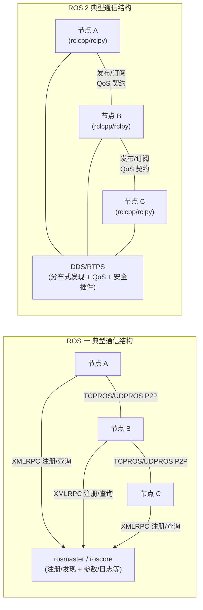

# ROS1 vs ROS2
## 维护
1. ROS 1 的最后一个发行版 Noetic 已在二〇二五年五月三十一日达到官方 EOL（停止官方维护与安全更新），继续把 ROS 1 作为“主干中间件”将带来持续累积的安全与供应链风险。
2. ROS 2 在公开仓库下载占比与社区问题流量上已显著占优
《2025 ROS Metrics Report》给出二〇二五年十月 ROS 2 下载占比为 91.2%，并显示 Robotics Stack Exchange 上与 ROS 相关的问题中，“ros2”标签远多于“ros1”
3. 
