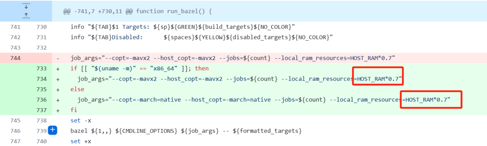

# Apollo ORIN Setup
参考链接：https://apollo.baidu.com/community/article/1237
## 配置
安装jetpack 版本为5.1.2，选择这个主要是对ubuntu 20.04的支持。
## docker设置
```
sudo groupadd docker
sudo usermod -aG docker 用户名
sudo systemctl restart docker
```
## 安装
scripts/apollo_base.sh中修改如果主机型号是orin的话


## 编译和启动
过程建议全程联外网
```
bash docker/scripts/dev_start.sh
./apollo.sh build_opt_gpu 跟容器名字
```


