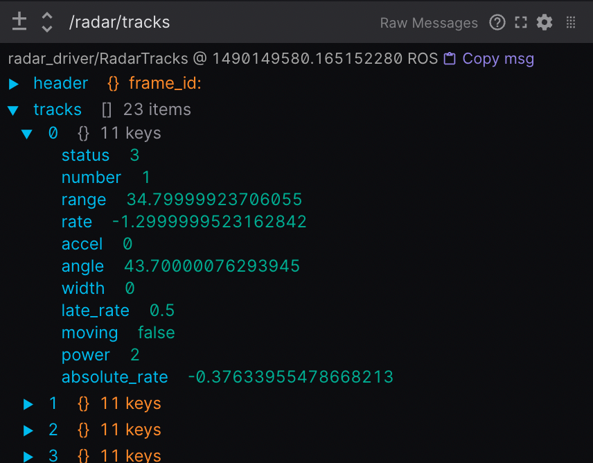

# 可视化调试工具需求
## 需求梳理

## 1. 数据可视化
1. 比如上下游到底发了一个什么消息，最好能在可视化工具里直接展示； 最好是有一个可视化界面，能显示从什么地方开始，到什么地方结束，发了什么，收到了什么，这条消息大小size。（可以以易于阅读的可折叠 JSON 树形格式显示传入主题数据。）  

2. 现在有什么话题topic在运行，谁订阅了这个话题，话题的消息队列里有多少条消息。
3. 可视化调试工具手动发布消息，测试话题的订阅和发布是否正常。
## 2. 内部线程的可视化
能把线程的执行路径在流程图上亮起来。现在有哪些回调函数在等消息，有哪些线程在运行，哪些线程在等待。哪些运行正常，给出节点状态
关键变量的值，比如说开关量  
## 3. 程序自身
